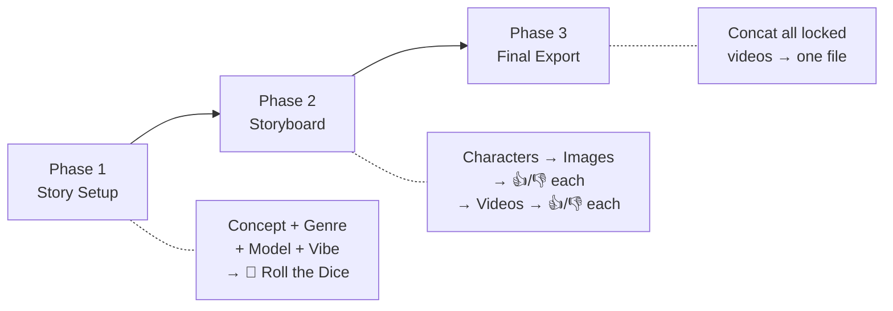

# 🧠 Smooth Brain Mode — Feature Spec

A child-friendly wizard: type a concept, set genre sliders, roll the dice, get a video. **Zero API keys, 100% offline.**

> [!TIP]
> **Retro Arcade Polish**: Each phase transition shows a pixel-art "STAGE 1" / "STAGE 2" / "STAGE 3" splash GIF with a 90s arcade announcer voice SFX. Assets go in `app/public/smoothbrain/` (GIFs + MP3s — user will source these).

---

## High-Level Pipeline



---

## Phase 1 — Story Setup

```
┌──────────────────────────────────────────┐
│  🧠 Smooth Brain Mode        [Expert →]  │
├──────────────────────────────────────────┤
│                                          │
│  💡 WHAT'S YOUR IDEA?                    │
│  ┌──────────────────────────────────┐    │
│  │ a cat on a windowsill           │    │
│  └──────────────────────────────────┘    │
│                                          │
│  🤖 VIDEO MODEL                          │
│  ▼ [ Wan 2.2 I2V 14B (High) ▾ ]         │
│                                          │
│  🖼️ IMAGE MODEL                          │
│  ▼ [ Qwen Image 2512 20B ▾ ]            │
│                                          │
│  🎬 HOW LONG?                            │
│  ○ 3 shots  ● 6 shots  ○ 10 shots       │
│                                          │
│  🎭 GENRE MIX                            │
│  Horror   ▓▓▓▓▓▓▓░░░  70%               │
│  Comedy   ▓▓▓░░░░░░░  30%               │
│  Action   ░░░░░░░░░░   0%               │
│  Romance  ░░░░░░░░░░   0%               │
│  Sci-Fi   ░░░░░░░░░░   0%               │
│  Fantasy  ░░░░░░░░░░   0%               │
│                                          │
│  ⏱️ SHOT LENGTH                           │
│  5s ▓▓▓▓▓▓▓░░░ 10s    [7s per shot]      │
│                                          │
│  🎨 VIBE                                 │
│  [🎬 Cinematic] [📱 Vertical] [🖼️ Sqr]  │
│                                          │
│         ┌──────────────────┐             │
│         │  🎲 Roll the Dice │             │
│         └──────────────────┘             │
│                                          │
│  ┌ STORY PREVIEW ──────────────────┐     │
│  │ Shot 1: A cat sits peacefully...│     │
│  │ Shot 2: It notices a shadow...  │     │
│  │ Shot 3: The shadow creeps...    │     │
│  │ 🔄 Re-roll   ✏️ Edit   🚀 Go!  │     │
│  └─────────────────────────────────┘     │
│                                          │
└──────────────────────────────────────────┘
```

**🚀 Go!** locks the story and transitions to **Phase 2**.

---

## Phase 2 — Storyboard (approve/reject pipeline)

Phase 2 has two stages that share the same visual storyboard grid.

### Stage A — Character & Image Generation

```
┌──────────────────────────────────────────────────┐
│  🧠 Phase 2: Storyboard          [← Back]       │
├──────────────────────────────────────────────────┤
│                                                  │
│  👤 YOUR CHARACTER(S)                            │
│  ┌────────┐ ┌────────┐  ┌──────────────────┐    │
│  │ char1  │ │ char2  │  │ + Upload / 🎨 Gen │    │
│  │  .jpg  │ │  .jpg  │  └──────────────────┘    │
│  └────────┘ └────────┘                           │
│                                                  │
│  📸 IMAGE STORYBOARD                             │
│  ┌──────┐ ┌──────┐ ┌──────┐ ┌──────┐ ┌──────┐  │
│  │ 🔄   │ │ 🔄   │ │  ✅  │ │ 🔄   │ │ 🔄   │  │
│  │ img1  │ │ img2  │ │ img3 │ │ img4 │ │ img5 │  │
│  │ 👍 👎 │ │ 👍 👎 │ │  ✅  │ │ 👍 👎 │ │ 👍 👎 │  │
│  └──────┘ └──────┘ └──────┘ └──────┘ └──────┘  │
│  Shot 5/6 rendering...  ████░░░░  62%            │
│                                                  │
│  All images approved? ──→ [▶ Generate Videos]    │
│                                                  │
└──────────────────────────────────────────────────┘
```

**How it works:**
1. User uploads character reference image(s) — or clicks **🎨 Gen** to generate one using their selected image model (Qwen Image / Flux2 Klein)
2. Headless render spins up → generates one image per shot using the story prompts + character refs
3. Images pop in one by one as they complete (reuse/expand the existing **watch folder** feature)
4. **👍** = lock that shot's image, **👎** = re-queue with a new seed
5. Once all shots show ✅, the **▶ Generate Videos** button appears

### Stage B — Video Generation

```
┌──────────────────────────────────────────────────┐
│  🧠 Phase 2: Storyboard          [← Back]       │
├──────────────────────────────────────────────────┤
│                                                  │
│  🎬 VIDEO STORYBOARD                             │
│  ┌──────┐ ┌──────┐ ┌──────┐ ┌──────┐ ┌──────┐  │
│  │  ▶   │ │  ▶   │ │  ✅  │ │ 🔄   │ │ 🔄   │  │
│  │ vid1  │ │ vid2  │ │ vid3 │ │ img4 │ │ img5 │  │
│  │ 👍 👎 │ │ 👍 👎 │ │  ✅  │ │ wait │ │ wait │  │
│  └──────┘ └──────┘ └──────┘ └──────┘ └──────┘  │
│  Shot 3/6 rendering... ████░░  50%               │
│                                                  │
│  All videos approved? ──→ [🏁 Export Final]      │
│                                                  │
└──────────────────────────────────────────────────┘
```

**How it works:**
1. Each locked image + its story prompt is pushed to the chosen I2V model for the chosen duration
2. Renders happen one at a time via headless Wan2GP
3. As each video completes, it **replaces the static image** on the storyboard — user can click to play
4. **👍** = lock that video, **👎** = re-render same image + prompt with a different seed
5. Once all shots show ✅, the **🏁 Export Final** button appears

---

## Phase 3 — Final Export

1. All approved video clips are concatenated in shot order into one seamless video file
2. Saved to the project's output folder
3. Playback preview shown inline
4. Option to go back and re-render individual shots

---

## Model Pickers (auto-detected)

Smooth Brain Mode reuses the existing `modelStore` infrastructure. On mount, it:

1. Calls `fetchModels()` → `/api/models` (scans Wan2GP `ckpts/` folder)
2. Shows **two dropdowns** filtered by capability:

| Dropdown | Filter | Example Models |
|---|---|---|
| 🖼️ Image Model | `capabilities.t2i` or family `qwen_image`, `flux2` | Qwen Image 2512 20B, Flux2 Klein 9B |
| 🤖 Video Model | `capabilities.i2v` or family `i2v`, `image2video` | Wan 2.2 I2V 14B (High), Wan Fun InP 14B |

3. If zero models found for either → show: "Install models in Wan2GP first!"
4. **Auto-accelerator**: When a model is selected, Smooth Brain auto-picks the fastest available accelerator profile (e.g., LightX2, FusioniX) from `modelStore.profiles`. User never sees accelerator settings.

### Shot duration → frames mapping
Selected video model determines FPS. Duration slider × FPS = `num_frames` (user never sees this).

| Model Family | FPS | 5s | 7s | 10s |
|---|---|---|---|---|
| Wan 2.x I2V | 16 | 81 frames | 113 frames | 161 frames |
| Hunyuan I2V | 24 | 121 frames | 169 frames | 241 frames |
| LTX Video | 24 | 121 frames | 169 frames | 241 frames |

> [!NOTE]
> Frame counts rounded to model-valid values (e.g., Wan needs `4k+1` frames).

---

## Story Engine (offline, no API key)

### How it works
1. **Shipped with app**: ~50 story arc templates per genre (7 genres = 350 templates)
2. **At runtime**: Weighted-random pick based on genre sliders, fill tokens with user's concept
3. Zero network calls, zero API keys

### Genre Mixing Logic
- Sliders sum to 100% (or normalize)
- Weighted random picks a primary genre arc
- **Re-roll**: Same sliders, different template + different fill words

### Template Library (shipped)

| Genre | Templates |
|---|---|
| 🧟 Horror | 50 |
| 😂 Comedy | 50 |
| 💥 Action | 50 |
| 💕 Romance | 50 |
| 🚀 Sci-Fi | 50 |
| 🧙 Fantasy | 50 |
| 🎭 Drama | 50 |

**350 templates × variable fill words = thousands of unique stories**

---

## User Controls Summary

| Control | Phase | Type | Purpose |
|---|---|---|---|
| Concept input | 1 | Text field | "a cat on a windowsill" |
| Image model picker | 1 | Dropdown | Qwen / Flux2 for character & shot images |
| Video model picker | 1 | Dropdown | I2V model for video generation |
| Shot count | 1 | 3 radio buttons | 3 / 6 / 10 shots |
| Shot duration | 1 | Slider (5–10s) | Seconds per shot |
| Genre sliders | 1 | Multi-slider | Horror, Comedy, Action, Romance, Sci-Fi, Fantasy, Drama |
| Vibe preset | 1 | Card picker | Resolution + style |
| 🎲 Roll the Dice | 1 | Button | Generate story |
| 🔄 Re-roll | 1 | Button | New random story |
| ✏️ Edit | 1 | Inline edit | Tweak shot prompts |
| 🚀 Go! | 1 | Button | Lock story → Phase 2 |
| 👤 Character upload | 2A | File picker / Gen | Reference image(s) |
| 👍 / 👎 (image) | 2A | Buttons per shot | Approve or re-render image |
| ▶ Generate Videos | 2A→2B | Button | Start video pipeline |
| 👍 / 👎 (video) | 2B | Buttons per shot | Approve or re-render video |
| 🏁 Export Final | 3 | Button | Concat + save final video |

---

## What Gets Hidden (vs Expert Mode)

All generation params, sections, takes, control video, VACE, sweep, trim, dependency chains, negative prompts, reference images. User sees: concept, sliders, storyboard, thumbs up/down.

---

## Implementation Files

| File | Purpose |
|---|---|
| `components/SmoothBrain/SmoothBrainWizard.tsx` | Main wizard (Phase 1) |
| `components/SmoothBrain/Storyboard.tsx` | Phase 2 storyboard grid |
| `components/SmoothBrain/CharacterSetup.tsx` | Character upload / generation |
| `components/SmoothBrain/ShotCard.tsx` | Individual shot with 👍/👎 |
| `components/SmoothBrain/GenreSliders.tsx` | Multi-genre slider component |
| `components/SmoothBrain/StoryEngine.ts` | Template picker + filler logic |
| `components/SmoothBrain/VibePresets.ts` | Resolution/style preset cards |
| `components/SmoothBrain/ModelPicker.tsx` | Filtered model dropdowns |
| `data/story-templates/*.json` | Pre-generated arc templates per genre |
| `uiStore.ts` | `smoothBrainMode` toggle + phase state |
| `Toolbar.tsx` | 🧠 toggle button |
